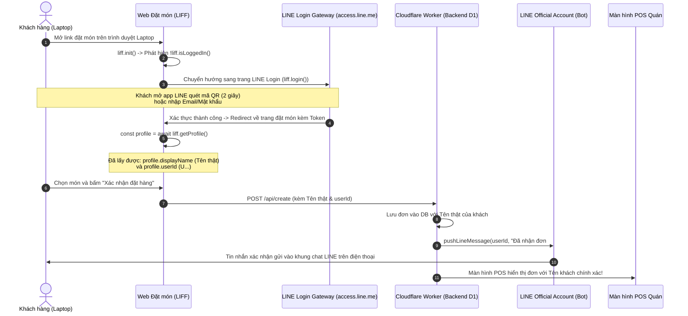

# Giải Thích Cơ Chế Đặt Hàng LINE Trên Laptop & Cách Hiển Thị Tên Khách Hàng

Tài liệu này giải thích chi tiết về nguyên nhân kỹ thuật tại sao người dùng đặt hàng qua Laptop trước đây không gửi được tin nhắn LINE, tại sao tên khách bị hiển thị là `顧客 (Web)`, và giải pháp khắc phục hoàn chỉnh thông qua **LINE Web Login**.

---

## 1. So Sánh Cơ Chế Hoạt Động: Mobile vs Laptop

| Tiêu chí | LINE App trên Điện Thoại (Mobile) | Trình Duyệt trên Laptop / Máy Tính (Desktop) |
| :--- | :--- | :--- |
| **Môi trường chạy** | Webview nhúng bên trong App LINE | Trình duyệt ngoài (Chrome, Safari, Edge,...) |
| **`liff.isInClient()`** | `true` (Nằm trong LINE Client) | `false` (Ngoài LINE Client) |
| **Trạng thái Đăng nhập** | Tự động đăng nhập ngầm 100% | Mặc định là `false` (Chưa đăng nhập) |
| **Tên & ID người dùng** | Tự động lấy được qua `liff.getProfile()` | **Không có** nếu chưa thực hiện đăng nhập qua `liff.login()` |
| **Hàm `liff.sendMessages()`** | ✅ **Hoạt động**: Gửi tin nhắn trực tiếp vào khung chat | ❌ **Không hoạt động**: LINE chặn gọi hàm này từ trình duyệt ngoài |

---

## 2. Tại Sao Trước Đây Trên Laptop Không Hiển Thị Tên Khách?

- **Thiếu phiên đăng nhập (Session Token):** Trên điện thoại, ứng dụng LINE tự cấp sẵn token định danh người dùng cho Webview. Nhưng trên máy tính, trình duyệt web hoàn toàn độc lập với phần mềm LINE nên web không thể tự ý đọc dữ liệu người dùng nếu người dùng chưa cấp quyền.
- **Dữ liệu mặc định:** Khi không lấy được tài khoản LINE, mã nguồn phía trước đã gán giá trị mặc định:
  ```javascript
  let profile = { userId: "", displayName: "顧客 (Web)" };
  ```
- **Hậu quả:** 
  1. Màn hình POS chỉ nhận được tên `"顧客 (Web)"` và không có `userId`.
  2. Quán không thể gửi thông báo tiến độ đơn hàng (Đã nhận đơn / Làm xong / Hủy) đến LINE của khách.
  3. Tin nhắn đơn hàng không xuất hiện trong khung chat LINE giữa khách và cửa hàng.

---

## 3. Làm Sao Để Lấy Tên Thật & ID Khách Hàng Trên Laptop?

Để lấy được tên thật và LINE User ID trên máy tính, hệ thống cần kích hoạt tính năng **LINE Login (`liff.login()`)**.

### Sơ Đồ Luồng Hoạt Động (Architecture Flow):



---

## 4. Chi Tiết Kỹ Thuật Khi Triển Khai

### A. Phía Frontend (`index.html`)

Khi khởi tạo ứng dụng (`initApp`):
```javascript
async function initApp() {
    await fetchMenu();
    renderMenu();
    
    await liff.init({ liffId: targetLiffId });

    // Nếu mở trên máy tính và chưa đăng nhập LINE
    if (!liff.isInClient() && !liff.isLoggedIn()) {
        // Tự động chuyển sang trang đăng nhập LINE
        liff.login();
        return;
    }

    // Sau khi đăng nhập, hàm này sẽ trả về thông tin thật của khách
    if (liff.isLoggedIn()) {
        const profile = await liff.getProfile();
        console.log("Tên khách:", profile.displayName); // Ví dụ: "陳小明" hoặc "Thuan Mai"
        console.log("User ID:", profile.userId);       // Ví dụ: "U1234567890abcdef..."
    }
}
```

### B. Phía Backend (`backend/src/modules/orders.ts`)

Khi nhận request từ `/api/create`:
1. Kiểm tra `order.userId` hợp lệ (`/^U[0-9a-fA-F]{32}$/`).
2. Lưu `order.customer` (Tên LINE thật) vào cơ sở dữ liệu `orders`.
3. Sử dụng `pushLineMessage(order.userId, ...)` để Bot gửi tin nhắn xác nhận đơn hàng vào tài khoản LINE của khách, bù đắp cho việc không thể gọi `liff.sendMessages()` từ trình duyệt máy tính.

---

## 5. Tổng Kết So Sánh Các Phương Án

| Phương Án | Ưu Điểm | Nhược Điểm | Đánh Giá |
| :--- | :--- | :--- | :--- |
| **Phương án A: Chặn hoàn toàn trên Laptop (Chỉ cho phép điện thoại)** | Đảm bảo 100% khách dùng app LINE trên điện thoại, giao diện di động tối ưu. | Khách dùng máy tính bắt buộc phải cầm điện thoại lên quét mã QR, không đặt trực tiếp được trên máy tính. | Phù hợp nếu quán muốn tập trung trải nghiệm 100% trên điện thoại. |
| **Phương án B: Kích hoạt LINE Web Login trên Laptop (Khuyên dùng)** | Khách đặt được trên Laptop, hiển thị đúng 100% **Tên thật + Avatar + LINE ID**, bot gửi tin nhắn vào LINE bình thường. | Khách trên laptop cần quét mã QR 1 lần để đăng nhập LINE trên trình duyệt. | **Toàn diện nhất**: Hỗ trợ đa nền tảng (cả Điện thoại lẫn Máy tính). |
